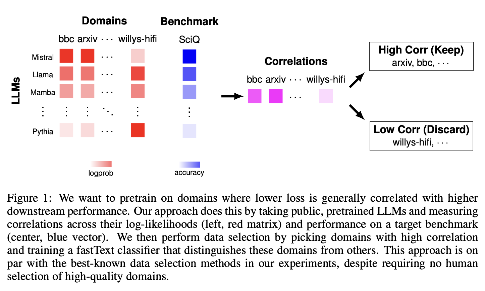

# Perplexity Correlations

This package can be used to get great pretraining data sampling distributions.

The input that you must provide is a matrix of (per-LLM, per-text) bits-per-byte
values, and a per-LLM vector of benchmark errors (ranging from 0 to 1, with lower
meaning better) on a benchmark that you care about. The vector of benchmark errors
could be the average from many benchmarks if you want.

The output that this package produces is a sampling distribution over pieces of
text that you could use directly to pretrain a strong LLM. Or you could use this
sampling distribution to train a fastText pretraining data filter that generalizes
to new pieces of text (reccomended).

Note that the set of LLMs can come from the kitchen sink: they can have different
tokenizers, architectures, scales, pretraining data. Another essential feature here is
that the number of texts can be far larger than the number of LLMs; our approach is
a very high-dimensional regression approach.

<div align="center">
  
</div>

Essentially, our approach encourages the training on domains where lower loss is
very correlated with higher downstream performance. We want
to pretrain on these domains, because pretraining on them will lower loss on them,
which we would expect to increase downstream performance. There is some deeper
theory here: https://arxiv.org/abs/2409.05816. Please cite this paper if you
find this package useful!

## Setup

Via PIP:

```bash
pip install perplexity-correlations
```

From source:

```bash
git clone https://github.com/TristanThrush/perplexity-correlations.git
cd perplexity-correlations
pip install -e .
```

## Getting bits-per-byte from LLM loss, on various pieces of text

Our approach requires you to generate an input matrix of (per-LLM, per-text)
bits-per-byte (BPB) values. BPB normalizes loss to reduce the impact of tokenizer
differences (see: https://arxiv.org/abs/2101.00027). To get bits-per-byte
from an LLM, you just need to do this (assuming the loss is the causal language
modelling loss averaged over tokens, which is typical):

```python
from transformers import AutoTokenizer, AutoModelForCausalLM
import numpy as np

model_name = "gpt2"
tokenizer = AutoTokenizer.from_pretrained(model_name)
model = AutoModelForCausalLM.from_pretrained(model_name)
model.eval()

text = "Some text from some web domain that I could use for pretraining."
inputs = tokenizer(text, return_tensors="pt")
input_ids = inputs['input_ids']

outputs = model(input_ids, labels=input_ids)

loss = outputs.loss.item()
num_tokens = input_ids.shape[-1]
num_bytes = len(text.encode('utf-8'))

bits_per_byte = (num_tokens/num_bytes)*loss/np.log(2)
```

## Estimating optimal per-text weights

Once you have the bits-per-byte values from a bunch of LLMs on a bunch of texts that
you care about, you can organize these values into a NxD numpy ndarray 
(N=number of LLMs, D=number of texts). You also need to get a N-length numpy array
which are the benchmark errors on some benchmark (or average of benchmarks) that
you care about. These errors should range from 0 to 1 and lower should mean better.

With these numpy arrays, you can use a variety of estimators that our package provides
to estimate the optimal text sampling weights relating performance and loss (assuming
an unknown monotonic relationship between performance and loss, which is more general
than typical scaling laws which assume a particular form for the monotonic
relationship like a power law or sigmoid). We reccomend using one of the following
options:

```python
from perplexity_correlations.estimation import spearmanr

estimate = spearmanr(bits_per_byte_matrix, benchmark_error_vector)
```

or

```python
from perplexity_correlations.estimation import sign_cdf

estimate = sign_cdf(bits_per_byte_matrix, benchmark_error_vector)
```

Note that these particular options are robust to outliers in the data, but the cost
is that they only return estimates for the optimal sampling weights that we can trust
up to the ranks of the values. In other words, the estimate might be TODO where the
true optimal weights might are [0.2, 0.5, 0.9]. We will see below that the ranks alone
can still be used to get a nice pretraining sampling distribution.


## Projecting the estimate to be a sampling distribution for pretraining

TODO

## Training a fastText pretraining data filter (optional but reccomended)

TODO


## Development Guidelines

Install the dev requirements and pre-commit hooks:

```bash
pip install -r requirements-dev.txt
pre-commit install
```

### Formatting and Linting

This project uses [Black](https://black.readthedocs.io/en/stable/) for code formatting
and [Flake8](https://flake8.pycqa.org/en/latest/) for linting. After installing the
pre-commit hooks above, these will run every time you make a commit.

### Testing

If new estimation and projection functions are added, the proofs may be nontrivial and
so it is useful to test that they actually do what we think. This project uses
[pytest](https://docs.pytest.org/en/stable/) for running tests, which are also run as
GitHub actions. Just run `pytest` locally to see if your tests pass.

## Citation

```bibtex
@misc{thrush2024perplexitycorrelations,
      title={Improving Pretraining Data Using Perplexity Correlations}, 
      author={Tristan Thrush and Christopher Potts and Tatsunori Hashimoto},
      year={2024},
      eprint={2409.05816},p
      archivePrefix={arXiv},
      primaryClass={cs.CL},
      url={https://arxiv.org/abs/2409.05816}, 
}
```


